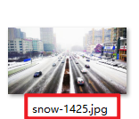
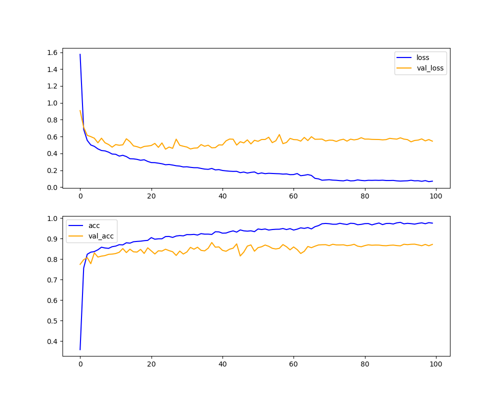

### 数据集：  
大小：训练集共7180张，测试集共808张  
种类：class_ = ['cloudy', 'dew', 'fogsmog', 'frost', 'glaze', 'hail', 'lightning', 'rain', 'rainbow', 'rime', 'sandstorm', 'shine', 'snow', 'sunrise']
训练集：data/train_data  
测试集：data/test_data  
label是数据集中图片名称的片段，截取 “ - ” 的前部分，如：  
  
### 训练命令：
````
python train.py 
--experiment_name
weather
--train_dir
data/train_data
--val_dir
data/test_data
````
### 可视化界面：  
位置在 “middle/history/”中，如：  
  

### 最后模型的精确度：

